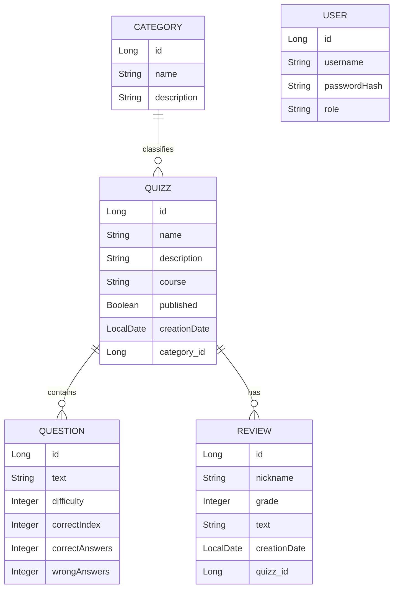

# Quizzer
The very first team project on the Software Development Project 1 course.

## Technical requirements
- Backend must be implemented with Java using the Spring Boot framework
- Frontend must be implemented with React

## Team members
- [Mikhail Nekrasov](https://github.com/Mikhail-Nekrasov) 
- [Jaime Garcia](https://github.com/Mineja2017)
- [Claudelle Klutse](https://github.com/Claudelle00)
- [Kirill Rakhimov](https://github.com/rakhimichi)
- [Naile Fejzullahu](https://github.com/LilaFej)
- [Mehedi Hridoy](https://github.com/Ghost-137)

# Scrum Project
- [Github Project](https://github.com/orgs/Push-Pray/projects/4)

# Flinga Board
- [Flinga Retrospective 1](https://edu.flinga.fi/s/EFPWNW2)
- [Flinga Retrospective 2](https://edu.flinga.fi/s/EMZSX9V)

# Quizzer - Developer Guide

Welcome to the **Quizzer** project! This guide is intended to help new developers quickly understand the project's technical details, architecture, and how to get started with the development environment.

## Table of Contents
1. [Project Overview](#project-overview)
2. [Tech Stack](#tech-stack)
3. [Project Structure](#project-structure)
4. [Getting Started](#getting-started)
5. [Database Configuration](#database-configuration)
6. [Best Practices & Recommended Tools](#best-practices--recommended-tools)
7. [Technical Documentation](#technical-documentation)
8. [Data Model](#data-model)
9. [Running Tests](#running-tests)

---

## Project Overview
Quizzer is a web application designed for creating and managing quizzes. It's the first team project for the Software Development Project 1 course. The application allows teachers (or admins) to create questions, assemble quizzes, and manage options using an intuitive dashboard.

## Project Deployment
Project address: https://quizzer-git-software-development-project-1-quizzer.2.rahtiapp.fi

## Tech Stack
The project is split into a backend built with Java and a frontend built with React.

### Backend
- **Language**: Java 21
- **Framework**: Spring Boot 3.4.4
- **Data Access**: Spring Data JPA
- **Database**: H2 (In-memory, for local development) & PostgreSQL (configured for production)
- **Object Mapping**: MapStruct (v1.6.3)
- **Templating**: Thymeleaf (included, though primarily used for REST APIs)

### Frontend
- **Language**: TypeScript
- **Library**: React 18
- **Tooling**: Vite
- **UI Framework**: Material UI (MUI v9)
- **Routing**: React Router v7

---

## Project Structure
The repository is a single monolithic codebase with the React app living inside the Spring Boot resource folder. 

### Backend Architecture
The backend files are located at `src/main/java/com/example/quizzer/` and follow a standard layered architecture:

* **`model/`**: Contains JPA entities (`Quizz`, `Question`, `User`) representing the database tables.
* **`repository/`**: Spring Data interfaces (`QuizzRepository`, `QuestionRepository`, `UserRepository`) handling database transactions.
* **`service/`**: Holds the business logic (`QuizzService`, `QuestionService`).
* **`RESTController/`**: Defines RESTful endpoints exposed to the frontend (`QuizzRestController`, `QuestionRestController`).
* **`DTO/`**: Data Transfer Objects (`QuestionDTO`, `QuizzInfoDTO`, etc.) used to format data for the API responses.
* **`mapper/`**: MapStruct interfaces (`QuestionMapper`, `QuizzMapper`) that automatically translate between Models and DTOs.

### Frontend Architecture
The frontend codebase is entirely located under `src/main/resources/Quizz/`.

* **`src/`**: Main frontend directory.
  * **`components/`**: React components. Noticeably, `TeacherDashboard/` handles all the teacher-specific views (e.g., `AddQuestion.tsx`, `QuizList.tsx`).
  * **`*api.ts` files**: Local services (`quizzapi.ts`, `questionapi.ts`, `optionapi.ts`) that orchestrate HTTP requests to the Spring Boot REST API.
  * **`App.tsx` & `main.tsx`**: React entry points and routing configuration.

---

## Getting Started

To run the full application locally, you will need to start both the Backend and Frontend servers.

### Prerequisites
- **JDK 21** installed.
- **Node.js** (v18 or higher recommended).

### 1. Starting the Backend
1. Open a terminal at the root directory of the project.
2. Run the Spring Boot application using the Maven Wrapper:
   - On Windows: `mvnw.cmd spring-boot:run`
   - On Mac/Linux: `./mvnw spring-boot:run`
3. The server will start on port `8080`.

### 2. Starting the Frontend
1. Open a new terminal and navigate to the React app folder:
   ```bash
   cd src/main/resources/Quizz
   ```
2. Install the Node dependencies:
   ```bash
   npm install
   ```
3. Start the Vite development server:
   ```bash
   npm run dev
   ```
4. The frontend will usually be accessible at `http://localhost:5173`. Make sure Vite proxies requests or the API client directs calls to `http://localhost:8080`.

---

## Database Configuration
For local development, the application uses an **H2 In-Memory Database**, meaning data is wiped every time the backend restarts.

According to `src/main/resources/application.properties`:
- **JDBC URL**: `jdbc:h2:mem:AppDB`
- **Username**: `sa`
- **Password**: `password`
- **Format SQL**: Enabled for debugging in the console.

To inspect the database natively, you can verify if the H2 console is enabled (visit `http://localhost:8080/h2-console` if Spring Boot DevTools exposes it). 
*Note: A PostgreSQL driver is available in the POM dependencies for production*

---

## Best Practices & Recommended Tools

### Tools & Extensions
- **IDE**: IntelliJ IDEA (Ultimate or Community) or Eclipse are highly recommended for the Spring Boot backend. 
- **VS Code**: A great editor for the Frontend folder. Ensure you have the **ESLint** and **Prettier** extensions to match the project's `eslint.config.js` settings.
- **Postman**: A collection is already provided in the repository (`New Collection.postman_collection.json`) to test API endpoints manually without the frontend.

### General Guidelines
- **Modifying APIs**: If you modify the Spring Model (`model/`), make sure to update its `DTO/` and its mapping in `mapper/` and run `mvnw clean compile` for MapStruct to regenerate the code.
- **Typescript Checks**: Use `npm run build` on the frontend before committing to verify there are no TypeScript errors.

## Technical Documentation

- **API Reference**
  **`Categories`**:
  - `GET /api/categories` - get all categories
  - `POST /api/categories` - create a new category
  - `DELETE /api/categories/{id}` - delete a category

  **`Questions`**:
  - `GET /api/quizz/{id}/question` - get questions for a quiz
  - `POST /api/quizz/{id}/question` - add a new question
  - `POST /api/question/{questionId}/option` - add an answer option
  - `POST /api/question/{questionId}/answer` - submit an answer
  - `GET /api/quizz/{quizzId}/question-results` - get quiz results
  - `GET /api/question/{questionId}/options` - get all answer options
  - `DELETE /api/question/{questionId}/option/{optionIndex}` - delete an answer option

  **`Quizzes`**:
  - `PUT /api/quizz/{id}` - update a quiz
  - `DELETE /api/quizz/{id}` - delete a quiz
  - `GET /api/quizz` - get all quizzes
  - `POST /api/quizz` - create a new quizz
  - `GET /api/quizz/{id}/questions` - get questions for a quiz
  - `GET /api/quizz/published` - get published quizzes
  - `DELETE /api/quizz/{quizzId}/question/{questionId}` - delete a question from a quiz

  **`Reviews`**:
  - `PUT /api/reviews/{reviewId}` - edit a review
  - `DELETE /api/reviews/{reviewId}` - delete a review
  - `POST /api/quizzes/{quizzId}/reviews` - post a new review
  - `GET /api/quizzes/{quizzId}/reviews` - get all reviews from a quizz

- **Frontend routes and views**
  - `/student` — published quiz list for students
  - `/student/quizz/:id` — quiz question list for a student
  - `/` — teacher quiz management dashboard
  - `/quizz/:id` — edit questions for a specific quiz (teacher view)
  - `/quizz/:quizId/question/:questionId` — edit option details for a single question

- **Sample data / seed data**
  - To add test quizzes, edit `SampleDataService.init()` method in `src/main/java/com/example/quizzer/SampleDataService.java`
  - Now it's filled with 2 test quizzes with several questions about geography, you can add any quizzes and questions you want.

## Data model



## Running Tests

You can run all tests from the command line using Maven.

On macOS and Linux:
   ```bash
   ./mvnw test
   ```

On Windows:
   ```bash
   mvnw.cmd test
   ```

To run a specific test class:

macOS / Linux:
   ```bash
   ./mvnw -Dtest=AnswerRestControllerTests test
   ```

Windows:
   ```bash
   mvnw.cmd -Dtest=AnswerRestControllerTests test
   ```

Tests use an in-memory H2 database defined in src/test/resources/application.properties. Test data is recreated before each test execution, and running tests does not affect the development database.
